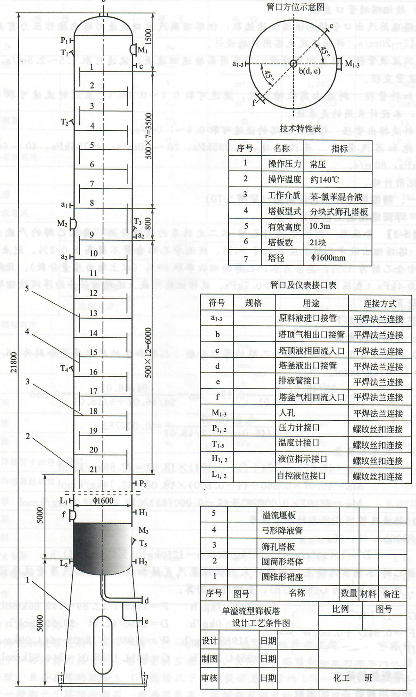

# 九、精馏塔附属设备与接管尺寸计算

## 9.1 进料预热器

由7.2，部分计算得到原料从20℃预热至泡点88.23℃所需的热量$Q_F=6.158\times10^5$,温度为$130℃$、压力为$270.25kPa$的水蒸汽走壳程，原料走管程。根据水蒸汽冷凝加热轻有机物时换热器的传热系数经验值范围为：$580~1190 \mathrm{W/(m^2·℃)}$，取$K=700 \mathrm{W/(m2·℃)}$。由传热速率方程$Q_F=K_AF\Delta t_m$，估算出预热器的换热面积$A_F$。

原料液从$20℃$加热到$88.23℃$，$\Delta t_1=110\qquad\Delta t_2=41.77$

$\Delta t_m=\frac{110-41.77}{\ln{\frac{110}{41.77}}}=67.56℃\\&$

$A_f=\frac{Q_F}{K\Delta t_m}=3.62\mathrm{m^2}$

## 9.2 塔顶全凝器

由7.3部分计算塔顶蒸汽温度为%80.29℃$，由7.4部分算得塔顶全凝器的热负荷$Q_C=2.097×10^6\mathrm{kJ/h}$，苯蒸汽走壳程被冷凝。管程走冷却水，进口水温为$35℃$，出口水温为$45℃$。也可用原料液作冷凝介质，原料同时被预热。为避免冷却水在管壁上严重结垢, 冷却水出口温度不应超过$50℃$。根据水为介质冷凝轻有机化合物蒸汽时的传热系数经验值范围为：$580~1160 W/(m^2·℃)$，取$K=700W/(m^2·℃)$。由传热整率方程$Q_C=KA_C\Delta t_m$，估算出预热器的换热面积$A_C$。冷却水从$35℃$被加热到$45℃$，苯蒸汽温度保持在$80.47℃$。

$\Delta t_1=45.29℃\qquad\Delta t_2=35.29℃$

$\Delta t_m=\frac{45.47-35.47}{\ln{\frac{45.47}{35.47}}}=40.26℃\\&$

$A_c=\frac{Q_F}{K\Delta t_m}=20.67\mathrm{m^2}$

## 9.3 塔釜再沸器

因为饱和液体进料，故$V'=V-(1-q)F=V$。在满足恒摩尔流假设的热损失的前提下，再沸器的热负荷与塔顶的全凝器应完全相同。实际上，塔顶和塔底的汽化摩尔潜热并不完全一致，且存在塔的热损失（一般情况下约为提供总热量的5%~10%），塔底再沸器的热负荷一般都大于塔顶冷凝器。

由7.5部分计算塔底泡点温度为%131.41℃$，由7.6部分算得塔顶全凝器的热负荷$Q_C=2.59×10^6\mathrm{kJ/h}$，温度为$170℃$、压力$792.59\mathrm{kPa}$的水蒸汽走壳程冷凝放热，氯苯走管程被加热沸腾汽化。根据水为介质冷凝轻有机化合物蒸汽时的传热系数经验值范围为：$580~1160 W/(m^2·℃)$，取$K=700W/(m^2·℃)$。由传热整率方程$Q_C=KA_C\Delta t_m$，估算出预热器的换热面积$A_C

$\Delta t_m=38.59℃\\&$

$A_c=\frac{Q_F}{K\Delta t_m}=26.63\mathrm{m^2}$

## 9.4 精馏塔管径

$d=\sqrt{\frac{4V}{\pi u}}$

## 9.4.1 塔顶蒸汽出口管径

取流速为$15\mathrm{m/s}$，流量为$0.494\mathrm{m^3/s}$，对应管径为$0.209\mathrm{m}$。

## 9.4.2 回流液管径

取流速为$2\mathrm{m/s}$，流量为$0.00061\mathrm{m^3/s}$，对应管径为$0.008\mathrm{m}$。

## 9.4.3 加料管径

取流速为$2\mathrm{m/s}$，流量为$0.00061\mathrm{m^3/s}$，对应管径为$0.038mathrm{m}$。

## 9.4.4 料液排出管径

取流速为$0.7\mathrm{m/s}$，流量为$0.00061\mathrm{m^3/s}$，对应管径为$0.064mathrm{m}$。

## 9.4.5 再沸器蒸汽管径

取流速为$30\mathrm{m/s}$，流量为$0.56\mathrm{m^3/s}$，对应管径为$0.154mathrm{m}$。

# 十、精馏塔设计工艺条件图

# 十一、安全与环保

## 11.1 安全因素

苯的闪点为-11°C, 其蒸汽在空气中的爆炸极限为1.2%~8%(V)；氯苯的闪点为28°C，在空气中的爆炸极限为1.83%~9.23%，都属于甲类火灾危险物品，易燃，遇明火、高热或氧化剂接触，有引起燃烧爆炸的危险。苯是致癌物质，氯苯对人体中枢神经系统有抑制和麻醉作用。因此，在精馏分离生产中要严格采取防火、防爆、防毒等安全卫生预防措施。

### 防火防爆措施

防火防爆基本措施的着眼点应放在限制和消除燃烧爆炸危险物、助燃物、着火源三者的相互作用上，防止燃烧三个条件（燃烧三要素）同时出现在一起。主要措施有着火源控制与消除、工艺过程的安全控制和限制火灾蔓延措施等几方面。

1. 严禁明火产生。加强加热用火管理措施；加强检修用火管理：对检修动火、使用喷灯、浇注沥青等作业要严格管理措施；加强流动火花和飞火管理措施。
2. 避免摩擦、撞击产生火花和危险温度。轴承转动摩擦、铁器撞击、工具使用过程打击都有可能产生火花和危险温度。因而设备转动部位应保持良好的润滑，以防断油发热；采用有色金属工用具，防止撞击火花的产生；搬运物料要轻搬轻放，防止发生火花。
3. 消除电气火花和危险温度。要根据爆炸和火灾危险等级和爆炸、火灾危险物质的性质，按照国家有关规定进行设计、安装。对车间内的电气动力设备、仪器、仪表、照明装置和电气线路等，分别采用防爆、封闭、隔离等措施。以防止电气火花和危险温度。
4. 安装避雷设施。为防止精馏塔、原料罐、中间罐、产品罐等设配遭遇雷击，应在精馏装置区内独立设置避雷设施，并定期检查维护。
5. 消除静电积聚。在化工企业从厂房设计、工艺设计、建设安装等方就应充分考虑导除静电的措施，如全厂地下接地网络设计、防雷、避雷设计，在易燃易爆车间，对工艺管线、设备等均要进行有效的接地，对一些电阻率高的易燃液体在运输、输送、罐装、搅拌中应设法导除静电，勿使静电积聚。对一些特别易燃易爆的岗位还应禁止穿易产生静电的化纤人造面料的服装。
6. 采用安全合理的工艺过程，制定科学、合理、严密的安全操作规程和工艺操作规程，在生产中尽可能用危险性小的物质代替危险性大的物质。

### 卫生健康措施

1. 严格操作章程。生产操作人员进入精馏装置时，需做好防护工作，应佩戴有褐色色标滤毒罐的防毒面具，防止苯和氯苯蒸汽吸入体内而中毒；同时在塔外需有监管人员对入塔时间进行监控。
2. 配备冲洗设施。装置区域内应备有安全沐浴处和眼睛冲洗器具。

## 11.2 三废处理

1. 废气处理装置区域内的废气来源主要是贮罐、塔顶及塔釜换热器的尾气，这些尾气应通过管道统一收集，首先经过活性碳或其它吸附剂将烟气中的固体吸附，之后送入焚烧工段处理剩余的可燃物质，最后需对尾气中苯及氯苯的含量进行检测，达标后才可放空。吸附剂应定期检查，及时更换或再生。
2. 废水处理废水处理相当复杂，处理方法的选择，必须根据废水的水质和数量，排放到的接纳水体或水的用途来考虑。同时还要考虑废水处理过程中产生的污泥、残渣的处理利用和可能产生的二次污染问题，以及絮凝剂的回收利用等。常用的废水处理基本方法可以分为以下几种：\
   - 物理法：利用物理作用处理、分离和回收废水中的污染物。例如用沉淀法除去水中相对密度大于1的悬浮颗粒的同时回收这些颗粒物；浮选法（或气浮法）可除去乳状油滴或相对密度近于1的悬浮物；过滤法可除去水中的悬浮颗粒；蒸发法用于浓缩废水中不挥发性的可溶性物质等。
   - 化学法：利用化学反应或物理化学作用回收可溶性废物或胶体物质，例如，中和法用于中和酸性或碱性废水；萃取法利用可溶性废物在两相中溶解度不同的“分配”，回收酚类、重金属等；氧化还原法用来除去废水中还原性或氧化性污染物，杀灭天然水体中的病原菌等。
   - 生物法：利用微生物的生化作用处理废水中的有机物。例如，生物过滤法和活性污泥法用来处理生活污水或有机生产废水，使有机物转化降解成无机盐而得到净化。以上方法各有其适应范围，必须取长补短，相互补充，往往很难用一种方法就能达到良好的治理效果。
